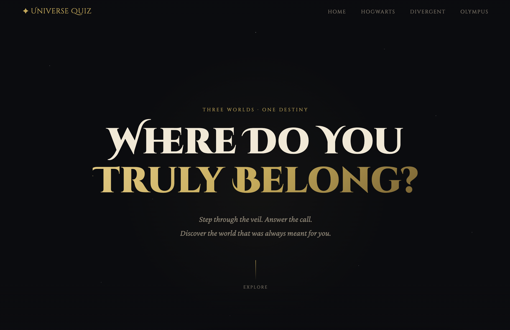

# 🌌 Universe Quiz Console

A beautifully crafted, immersive web-based quiz application built with **Flask** and **JavaScript**. This project allows users to discover their destiny across multiple fictional universes, including the Wizarding World of Hogwarts, the Faction System of Chicago (Divergent), and the Divine Heritage of Camp Half-Blood (Olympus).



## ✨ Features

- **Multi-Universe Support:** Switch between Hogwarts, Chicago (Divergent), and Olympus themes seamlessly.
- **Immersive UI:** High-fidelity animations, particle effects (sparks), and universe-specific dynamic styling using CSS variables and data attributes.
- **Responsive Design:** Fluid typography using CSS `clamp()` and adaptive layouts ensuring the experience is magical on both desktop and mobile.
- **Dynamic Quiz Engine:** A flexible backend that serves unique questions for each universe and calculates results in real-time.
- **Clean Architecture:** Modern web practices with a separation of concerns between Python logic and JavaScript/CSS presentation.

## 🛠️ Technology Stack

- **Backend:** [Python](https://www.python.org/) & [Flask](https://flask.palletsprojects.com/)
- **Frontend:** HTML5, CSS3 (Modern features like Custom Properties & Data Attributes), and Vanilla JavaScript
- **Templating:** Jinja2

## 📂 Project Structure

```text
fiction-quiz/
├── app.py                 # Main Flask application & routes
├── universe/              # Universe-specific logic and questions
│   ├── hogwarts/
│   ├── chicago/
│   └── olympus/
├── templates/             # Jinja2 HTML templates
│   ├── base.html          # Shared layout (Navbar, Footer, Global Styles)
│   ├── index.html         # Home page (Universe selection)
│   ├── quiz.html          # Dynamic quiz interface
│   └── result.html        # Immersive result reveal page
└── requirements.txt       # Python dependencies
```

## 🚀 Getting Started

### 1. Prerequisites
Ensure you have **Python 3.8+** installed on your system.

### 2. Installation
Clone the repository and navigate to the project folder:
```bash
cd fiction-quiz
```

### 3. Set Up Virtual Environment (Recommended)
```bash
python3 -m venv venv
source venv/bin/activate  # On Windows use: venv\\Scripts\\activate
```

### 4. Install Dependencies
```bash
pip install -r requirements.txt
```

### 5. Run the Application
```bash
python3 app.py
```
Visit `http://127.0.0.1:5000` in your browser to start your journey.

## 🎨 Theme Customization
The project uses `data-universe` attributes on main wrappers to switch themes without reloading CSS.
- **Hogwarts:** Red/Gold palette with `Cinzel` typography.
- **Chicago:** Orange/Dark palette with faction-based iconography.
- **Olympus:** Blue/Gold palette with divine lightning effects.

## 📝 License
This project is for educational purposes. All fictional universe trademarks belong to their respective owners.
